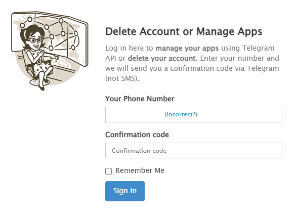

# PersonalTelegram Manual

This module connects the [Telegram](https://my.telegram.org/apps) with Rocketbot. You can connect with Telegram, get chats, groups and channels IDs, send messages and read chats from every channel in Telegram.

## How to install this module

**Download** and **install** the content in `modules` folder in Rocketbot path

## How to use this module

To use this module you need to create an app and obtain the `api_id` and the `api_hash`.

1. Go to [http://my.telegram.org/apps](http://my.telegram.org/apps) and register an app with a name, short name, and pick the plataform. The fields url and description can stay empty. After that click on `Create application`.

2.  On the next screen fill your phone number with the country code (`+54` for example).

    If you don't remember your phone number, you can find it on the mobile app or desktop app under the upper left button (three horizontal bars). The number appears right after you profile pic and your name.

3. Telegram will send you a code and reload the web, in which it will appear a new field where you have to complete the code sent to your number.

4. Once logged in, you have to copy the `api_id` and `api_hash` to link rocketbot with Telegram. (In the picture those fields are redacted)

   The `api_id` is a sequence of number like `63890321` and the `api_hash` is a alphanumeric code like `a28dcb716385e267fa9a46a65e5682e7`.

That's it! You are ready to connect Rocketbot with Telegram.

## Description of commands

### Connect with Telegram

It will connect Telegram with Rocketbot via `API ID`, `API hash` and `Telephone Number`.

| Parameters       | Description                                                       | Example                          |
| ---------------- | ----------------------------------------------------------------- | -------------------------------- |
| API ID           | Obtained from [my.telegram.org/apps](http://my.telegram.org/apps) | 12345678                         |
| API hash         | Obtained from [my.telegram.org/apps](http://my.telegram.org/apps) | abcdefghigklmnop1234567890abcde0 |
| Telephone Number | Telephone number of the account                                   | +99 1234 5678                    |

### Get chats IDs

This command will get the all the chats IDs, then it will save it to a variable and print them on the terminal.

| Parameters | Description                                                | Example |
| ---------- | ---------------------------------------------------------- | ------- |
| Result     | Name of the variable where the return value will be stored | result  |

### Send Message

This will send a message to the mentioned Chat ID

| Parameters | Description                            | Example      |
| ---------- | -------------------------------------- | ------------ |
| Message    | Body of the message                    | Hello World! |
| Chat ID    | Chat ID where the message will be sent | -10435435    |

### Read Messages

This command will read all the messages of the Chat ID and return them in a variable.

If you only want the messages, select `Just the messages`, to get all the metadata, select `all the metadata`

| Parameters | Description                                                | Example           |
| ---------- | ---------------------------------------------------------- | ----------------- |
| Chat ID    | Chat ID which will be read                                 | -10435435         |
| Result     | Name of the variable where the return value will be stored | result            |
| Download   | Select to download just the messages or all the metadata   | Just the messages |
