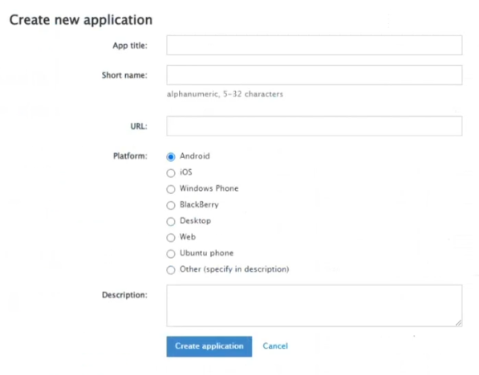
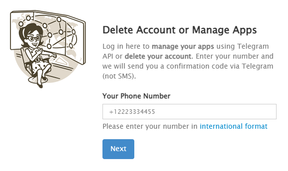
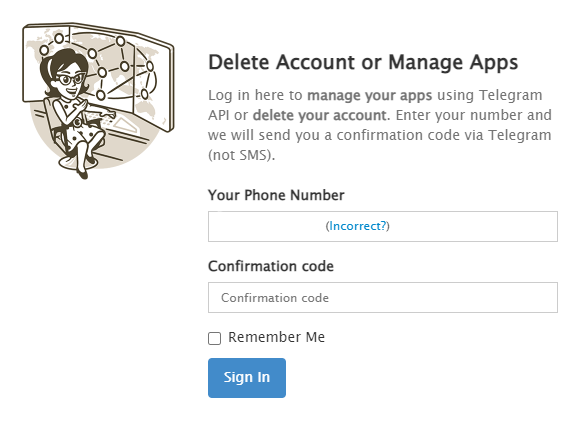
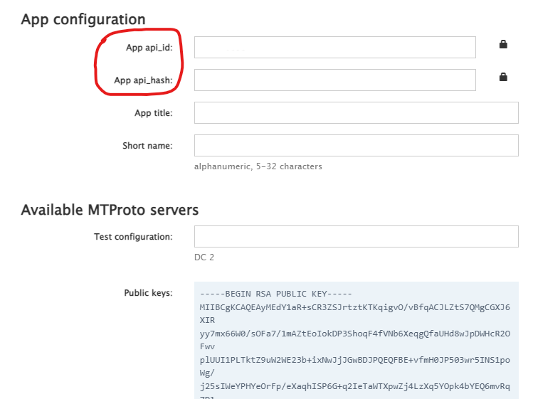

# PersonalTelegram Manual

Este módulo se conecta con [Telegram](https://my.telegram.org/apps). Puedes conectarte con Telegram, obtener IDs de contactos, grupos y canales, enviar mensajes y leer canales de Telegram

## Como instalar este módulo

**Descarga** e **instala** el contenido en la carpeta `modules` en la ruta de rocketbot.

## Cómo usar este módulo

Para utilizar este módulo tienes que crear una app y obtener el `api_id` y el `api_hash`.

1. Entra en [http://my.telegram.org/apps](http://my.telegram.org/apps) y crea tu aplicación con un nombre, nickname, y elige la plataforma. Luego has click en `Create application`

2. Luego completas tu número de telefono de Telegram con el código de país (`+54` por ejemplo).

   Si no sabes con qué numero te registraste en Telegram, puedes verlo en la app del celular o en la app de escritorio haciendo el boton superior izquierdo de opciones (tres líneas horizontales) y el número aparece debajo de tu foto de perfil y tu nombre.

3. Telegram te enviará un código a tu teléfono y en la página te aparece un campo nuevo devajo para compeltar el código.

4. Una vez logueado, tienes que copiar el `api_id` y el `api_hash` para vincular rocketbot con tu Telegram. (En la foto estan en blanco).

   El `api_id` es una serie de números como por ejemplo `63890321` y el `api_hash` es un código alfanumerico como por ejemplo `a28dcb716385e267fa9a46a65e5682e7`.

    Listo! Ya están realizadas las credenciales para Rocketbot

## Descripción de los comandos

### Conectar con Telegram

Conectará a Rocketbot con la cuenta indicada en `API ID`, `API hash` y `Número de teléfono`.

| Parámetros         | Descripción                                                            | Ejemplo                          |
| ------------------ | ---------------------------------------------------------------------- | -------------------------------- |
| API ID             | Código obtenido de [my.telegram.org/apps](http://my.telegram.org/apps) | 12345678                         |
| API hash           | Código obtenido de [my.telegram.org/apps](http://my.telegram.org/apps) | abcdefghigklmnop1234567890abcde0 |
| Número de teléfono | Número de teléfono de la cuenta                                        | +99 1234 5678                    |

### Obtener IDs de chats

Este comando devolverá en una variable y en la terminal de Rocketbot la lista de todos los chats con su correspondientes IDs.

| Parámetros | Descripción                                                      | Ejemplo |
| ---------- | ---------------------------------------------------------------- | ------- |
| Resultado  | Nombre de la variable donde se asignará el resultado del comando | result  |

### Enviar mensaje

Este commando enviará el mensaje al chat ID indicado

| Parámetros | Descripción                                       | Ejemplo      |
| ---------- | ------------------------------------------------- | ------------ |
| Mensaje    | Cuerpo del mensaje                                | Hello World! |
| Chat ID    | Número de ID del chat donde se enviará el mensaje | -10435435    |

### Leer mensajes

Este commando leerá todos los mensajes del correspondiente Chat ID.

Para devolver solo los mensajes, seleccionar `Just the messages`, para devolver toda la metadata seleccionar `all the metadata`

| Parámetros | Descripción                                                      | Ejemplo           |
| ---------- | ---------------------------------------------------------------- | ----------------- |
| Chat ID    | Número de ID del chat donde se leerá el chat                     | -10435435         |
| Resultado  | Nombre de la variable donde se asignará el resultado del comando | result            |
| Descargar  | Elegir solo descargar mensajes o toda la metadata                | Just the messages |
